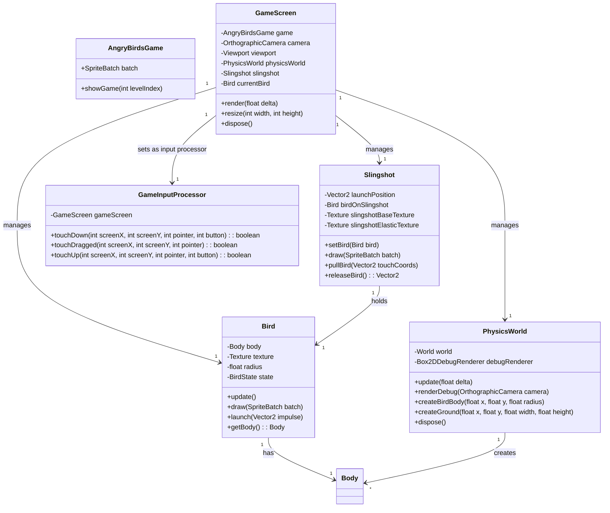

# Conception Architecturale pour la Mécanique de Lancement

## 1. Introduction

Ce document décrit la conception architecturale pour l'implémentation de la mécanique de lancement de type "Angry Birds" dans le projet LibGDX existant. L'objectif est d'assurer une séparation claire des préoccupations (GameScreen, gestion des entrées, logique physique) et de faciliter l'extensibilité pour de futurs ajouts comme des obstacles et des ennemis.

## 2. Composants Clés

Nous introduirons plusieurs nouvelles classes et modifierons `GameScreen` pour intégrer la nouvelle fonctionnalité.

### 2.1. `GameScreen` (Modifié)

La classe `GameScreen` sera le coordinateur principal. Elle sera responsable de :

*   Initialiser et gérer le `PhysicsWorld`.
*   Initialiser et gérer le `Slingshot` et les `Bird`s.
*   Mettre à jour la logique du jeu (appeler les méthodes `update` des autres composants).
*   Rendre tous les éléments du jeu (arrière-plan, lance-pierre, oiseaux, etc.).
*   Définir le `InputProcessor` pour gérer les entrées utilisateur.

### 2.2. `PhysicsWorld` (Nouveau)

Cette classe encapsulera toute la logique Box2D. Ses responsabilités incluront :

*   Créer et gérer l'instance `World` de Box2D.
*   Effectuer les étapes de simulation physique (`world.step()`).
*   Gérer le rendu de débogage de Box2D (`debugRenderer`).
*   Fournir des méthodes pour créer des corps physiques (oiseaux, sol, obstacles).
*   Convertir les unités entre les pixels LibGDX et les mètres Box2D.

### 2.3. `Bird` (Nouveau)

La classe `Bird` représentera un oiseau individuel. Chaque oiseau aura :

*   Un corps physique Box2D (`Body`).
*   Une texture ou une animation pour le rendu.
*   Un état (par exemple, `ON_SLINGSHOT`, `FLYING`, `HIT`).
*   Des méthodes pour dessiner l'oiseau et mettre à jour sa position/rotation en fonction de son corps Box2D.

### 2.4. `Slingshot` (Nouveau)

La classe `Slingshot` gérera le lance-pierre et son interaction avec l'oiseau. Ses fonctions principales seront :

*   Dessiner le lance-pierre (base, élastiques).
*   Maintenir la position de l'oiseau lorsqu'il est sur le lance-pierre.
*   Calculer la force/impulsion de lancement basée sur le déplacement de l'oiseau par le joueur.
*   Déclencher le lancement de l'oiseau en appliquant une impulsion à son corps Box2D.

### 2.5. `GameInputProcessor` (Nouveau)

Cette classe implémentera l'interface `InputProcessor` de LibGDX pour gérer les interactions utilisateur spécifiques au jeu. Elle sera responsable de :

*   Détecter les événements de toucher/clic et de glisser.
*   Interpréter les gestes de glisser pour le lancement de l'oiseau.
*   Communiquer avec le `Slingshot` pour mettre à jour la position de l'oiseau tiré et déclencher le lancement.

## 3. Diagramme de Classes (Simplifié)

## 4. Flux de Travail du Lancement

1.  **Initialisation** : `GameScreen` crée `PhysicsWorld`, `Slingshot` et un `Bird` initial, puis place l'oiseau sur le `Slingshot`.
2.  **Input (touchDown)** : `GameInputProcessor` détecte un toucher sur l'oiseau sur le lance-pierre. Il informe le `Slingshot` que l'oiseau est en cours de tirage.
3.  **Input (touchDragged)** : `GameInputProcessor` transmet les coordonnées de glissement au `Slingshot`. Le `Slingshot` met à jour la position de l'oiseau (visuellement tiré en arrière) et calcule la force de lancement potentielle.
4.  **Input (touchUp)** : `GameInputProcessor` détecte le relâchement. Il informe le `Slingshot` de relâcher l'oiseau. Le `Slingshot` calcule l'impulsion finale et l'applique au corps Box2D de l'oiseau via `Bird.launch()`.
5.  **Simulation Physique** : Dans la boucle `render` de `GameScreen`, `PhysicsWorld.update()` est appelé pour simuler la physique. Le `Bird` met à jour sa position et sa rotation en fonction de son corps Box2D.
6.  **Rendu** : `GameScreen` appelle les méthodes `draw` du `Slingshot` et du `Bird` pour les rendre à leurs positions mises à jour.

## 5. Considérations pour l'Extensibilité

*   **Oiseaux Multiples** : La classe `Bird` est générique. `GameScreen` peut gérer une liste de `Bird`s et un index pour l'oiseau actuel.
*   **Obstacles et Ennemis** : `PhysicsWorld` inclura des méthodes pour créer différents types de corps Box2D (statiques pour les obstacles, dynamiques pour les ennemis). Ces entités auront leurs propres classes (par exemple, `Obstacle`, `Enemy`) qui contiendront un `Body` Box2D et des logiques de rendu/mise à jour similaires à `Bird`.
*   **Niveaux** : Les données de niveau (positions des obstacles, nombre d'oiseaux, etc.) peuvent être chargées à partir de fichiers externes et utilisées par `GameScreen` pour initialiser `PhysicsWorld` et les entités.

Ce plan fournit une base solide pour l'implémentation de la fonctionnalité demandée. Il assure la modularité et la maintenabilité du code.
